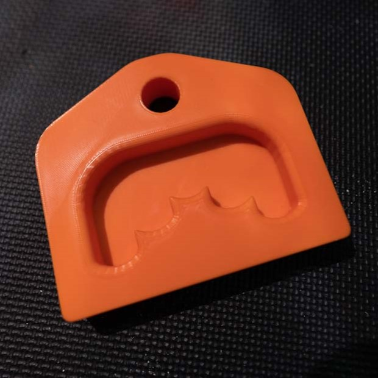

# Training tools for rock climbing

This repository currently includes an unlevel edge for training your fingers. You can print it using a 3D printer, or
cut from wood using a CNC router. I've included the AutoCAD files from different steps when modeling the object, so that
you can customize the design to suit your fingers. If you want to add your own objects to the repository, feel free to
create a pull request.

